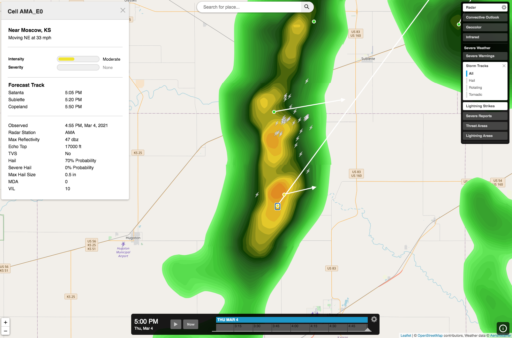

Aeris JS SDK - Severe Weather Module
===========================

Starting with version 1.3.0 of the [Aeris Javascript SDK](https://www.aerisweather.com/support/docs/toolkits/aeris-js-sdk/), you can now create and add [map source modules](https://www.aerisweather.com/support/docs/toolkits/aeris-js-sdk/map-modules/) to easily include custom data sources and layers to your [InteractiveMapApp](https://www.aerisweather.com/support/docs/toolkits/aeris-js-sdk/interactive-map-app/) and [InteractiveMap](https://www.aerisweather.com/support/docs/toolkits/aeris-js-sdk/interactive-map/) instances. 

We've created this Severe module as an example for you to reference when creating your own custom modules for your mapping applications. Feel free to use this module in your own projects, whether you're using our [precompiled SDK scripts](https://www.aerisweather.com/support/docs/toolkits/aeris-js-sdk/getting-started/script-usage/) or [importing our NPM package](https://www.aerisweather.com/support/docs/toolkits/aeris-js-sdk/getting-started/module-usage/) into your Javascript projects.



## Using the Module

The method for adding the Severe module to your project depends on how your project is setup, either as a module-based/NodeJS project or using precompiled scripts in an HTML file. Follow the appropriate examples below for your project's use case.

### Module/NodeJS Project

If you are developing your own JavaScript application using a NodeJS server or using NPM libraries, you can use the source files in this repository and import them as needed within your maps.

**NOTE:** This module is written using Typescript and modern ES6 Javascript syntax. If you need the module's Typescript source compiled to Javascript, use the source files located within the `dist/src/` directory or run `yarn build` from the root of this project's directory to recompile the source files.

The following is an example of importing and using the project source files in your Javascript project:

```javascript
import AerisWeather from '@aerisweather/javascript-sdk/dist/AerisWeather';
import InteractiveMapApp from '@aerisweather/javascript-sdk/dist/apps/InteractiveMapApp';
import Severe from 'path/to/awxjs-severe-weather-module/dist/src/Severe';

const aeris = new AerisWeather('CLIENT_ID', 'CLIENT_SECRET');

const app = new apps.InteractiveMapApp('#app', {
    account: aeris.account(),
    // config options...
});
app.on('ready', () => {
    app.modules.add(new Severe());
});
```

### Precompiled Script

To start using our Severe module quickly and easily, just load our precompiled script into your HTML and add it to your maps:

[awxjs-severe-weather.min.js](https://cdn.aerisapi.com/sdk/js/modules/severe/latest/awxjs-severe-weather.min.js)

```html
<!DOCTYPE html>
<html>
<head>
	<meta charset="utf-8">
	<meta http-equiv="X-UA-Compatible" content="IE=edge,chrome=1">
	<meta name="viewport" content="width=device-width, user-scalable=no">
	<title>Aeris JS - Severe Module</title>

    <link rel="stylesheet" href="https://cdn.aerisapi.com/sdk/js/latest/aerisweather.css">
	<style>
	html, body {
		height: 100%;
		margin: 0;
		padding: 0;
		width: 100%;
	}
    #app {
        height: 100%;
        width: 100%;
    }
	</style>
</head>
<body>

    <div id="app"></div>

<script>
window.addEventListener('load', () => {

    const aeris = new AerisWeather('CLIENT_ID', 'CLIENT_SECRET');

    aeris.apps().then((apps) => {
        const app = new apps.InteractiveMapApp('#app', {
            // config options...
        });
        app.on('ready', () => {
            app.modules.add(new Severe());
        });
    });

});
</script>

<script src="https://cdn.aerisapi.com/sdk/js/latest/aerisweather.min.js"></script>
<script src="https://cdn.aerisapi.com/sdk/js/modules/severe/latest/awxjs-severe-weather.min.js"></script>

</body>
</html>
```

## Map Module Documentation

We have extensive [documentation](https://www.aerisweather.com/support/docs/toolkits/aeris-js-sdk/map-modules/) online when using map modules with [InteractiveMapApp](https://www.aerisweather.com/support/docs/toolkits/aeris-js-sdk/map-modules/interactive-map-app/) and [InteractiveMap](https://www.aerisweather.com/support/docs/toolkits/aeris-js-sdk/map-modules/interactive-map/) instances, which will go into more detail on the various options available to you related to map modules.

## Support

Feel free to [submit a new ticket](http://helpdesk.aerisweather.com/) with any questions, bug reports or feature suggestions you have. You can also reach out to us on Twitter at [@AerisWeather](https://twitter.com/AerisWeather).
